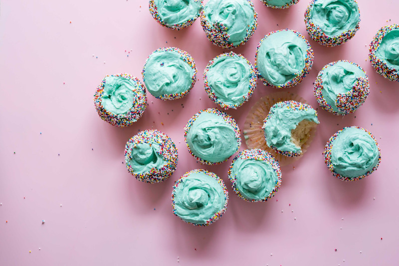

# Card

## Preview
---
<div style="display: flex; justify-content:center;">
    <pkt-card style="width: 90%; max-width: 450px;">
        <h2 class="bg-a1 border-top-radius">Dessert</h2>
        
        <p>
            A whole batch of basic vanilla cupcakes, topped with the best
            buttercream I’ve ever ever. If you don’t know how to make anything
            else in your life, at very least, perfect the vanilla cupcake.
        </p>
        <pkt-button-group>
            <button class="bg-int-p">
                <pkt-icon set="adwaita" name="emblem-favorite"></pkt-icon>
            </button>
            <button class="bg-int-p">
                <pkt-icon set="adwaita" name="emblem-shared"></pkt-icon>
            </button>
        </pkt-button-group>
    </pkt-card>
</div>

## Usage
---
```html
<pkt-card>
    <h2 class="bg-a1 border-top-radius">Dessert</h2>
    
    <p>
        A whole batch of basic vanilla cupcakes, topped with the best
        buttercream I’ve ever ever. If you don’t know how to make anything
        else in your life, at very least, perfect the vanilla cupcake.
    </p>
    <pkt-button-group>
        <button class="bg-int-p">
            <pkt-icon set="adwaita" name="emblem-favorite"></pkt-icon>
        </button>
        <button class="bg-int-p">
            <pkt-icon set="adwaita" name="emblem-shared"></pkt-icon>
        </button>
    </pkt-button-group>
</pkt-card>
```

> CSS UI class `border-top-radius` or `border-bottom-radius` can be used to make round corner for elements inside.

## SCSS
---

```scss
@use 'path/to/_ui.scss';

card {
    @include ui.card($radius: $border-radius);
}
```

|Argument|Description|Example value|
|---|---|---|
|`$radius`|border radius|`4px` `1em`|
